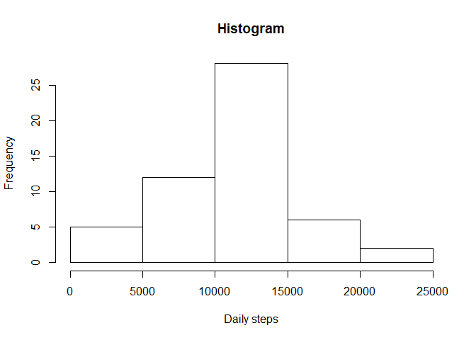
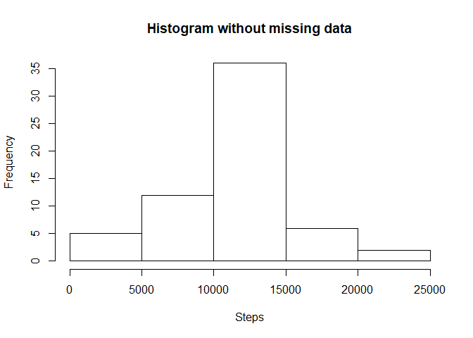
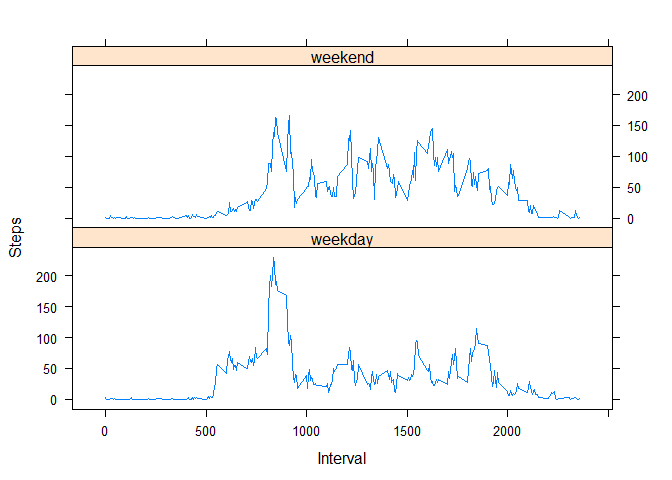

This is a report based on data from an activity monitoring device . This device collects data at 5-minute intervals through out the day. The data consists of two months of data from an anonymous individual collected during the months of October and November, 2012 and include the number of steps taken in 5 minute intervals each day.

The original dataset ws stored in a comma-separated-value (CSV) file with 17,568
observations and 3 variables:

- **steps:** Number of steps taking in a 5-minute interval (missing values are coded as NA)  
- **date:** The date on which the measurement was taken in YYYY-MM-DD format  
- **interval:** Identifier for the 5-minute interval in which measurement was taken  

## 1- Loading and preprocessing data
### a- Load the data

```r
setwd("C:/Users/mtravacio/Desktop/Documentos/Data Science/DS Specialization_Johns Hopkins/05-Reproducible Research")
data <- read.csv("./activity.csv")
```

### b- Process/transform the data (if necessary) into a format suitable for your analysis

```r
daily_steps <- aggregate(steps ~ date, data, sum, na.rm = TRUE)
```


## 2- What is the mean total number of steps taken per day?
### a-Make an histogram of the total number of steps taken each day

```r
hist(daily_steps$steps, xlab = "Daily steps", main = "Histogram")
```

<!-- -->

### b- Calculate and report the **mean** and **median** total number of steps taken per day

```r
mean(daily_steps$steps)
```

```
## [1] 10766.19
```

```r
median(daily_steps$steps)
```

```
## [1] 10765
```
The mean total number of steps taken per day is **10,766** steps and the median is **10,765** steps.


## 3- What is the average daily activity pattern?
### a- Make a time series plot (i.e. type = "l") of the 5-minute interval (x-axis) and the average number of steps taken, averaged across all days (y-axis)

```r
interval_steps <- aggregate(steps ~ interval, data, mean, na.rm = TRUE)
plot(steps ~ interval, interval_steps, type = "l", xlab = "Interval", ylab = "Steps")
```

<!-- -->

### b- Which 5-minute interval, on average across all the days in the dataset, contains the maximum number of steps?

```r
interval_steps[which.max(interval_steps$steps), ]$interval
```

```
## [1] 835
```
The interval that contains the maximum number of steps is **835**.


## 4- Imputing missing values
### a- Calculate and report the total number of missing values in the dataset

```r
sum(is.na(data$steps))
```

```
## [1] 2304
```
There is a total of **2,304 missing values**.

### b- Devise a strategy for filling in all of the missing values in the dataset. The strategy does not need to be sophisticated. For example, you could use the mean/median for that day, or the mean for that 5-minute interval, etc.
The strategy selected for filling in missing values is the round mean for the 5-minute interval:

```r
non_na <- ifelse(is.na(data$steps),
       round(interval_steps$steps[match(data$interval, interval_steps$interval)], 0),
        data$steps)
```

### c- Create a new dataset that is equal to the original dataset but with the missing data filled in.

```r
all_data <- data.frame(steps = non_na, date = data$date, interval = data$interval)
```

### d- Make a histogram of the total number of steps taken each day and Calculate and report the mean and median total number of steps taken per day. Do these values differ from the estimates from the first part of the assignment? What is the impact of imputing missing data on the estimates of the total daily number of steps?

```r
all_daily_steps <- aggregate(steps ~ date, all_data, sum)
hist(all_daily_steps$steps, xlab = "Steps", main = "Histogram without missing data")
```

<!-- -->

```r
mean(all_daily_steps$steps)
```

```
## [1] 10765.64
```

```r
median(all_daily_steps$steps)
```

```
## [1] 10762
```
The mean and median total number of steps taken per day are **10,766** and **10,762**, respectively. There was a little when imputing missing data on the estimates of the total daily number of step.


## 5- Are there differences in activity patterns between weekdays and weekends?
### a- Create a new factor variable in the dataset with two levels -- "weekday" and "weekend" indicating whether a given date is a weekday or weekend day.

```r
all_data$dateFormat <- as.Date(all_data$date, format = "%Y-%m-%d")
all_data$weekday <- weekdays(all_data$dateFormat)
all_data$typeofday <- ifelse(all_data$weekday == 'sábado' | all_data$weekday =='domingo',
                             'weekend','weekday')
```

### b- Make a panel plot containing a time series plot (i.e. type = "l") of the 5-minute interval (x-axis) and the average number of steps taken, averaged across all weekday days or weekend days (y-axis). 

```r
avSteps_wd <- aggregate(steps ~ interval + typeofday, data = all_data, mean)
head(avSteps_wd)
```

```
##   interval typeofday      steps
## 1        0   weekday 2.28888889
## 2        5   weekday 0.40000000
## 3       10   weekday 0.15555556
## 4       15   weekday 0.17777778
## 5       20   weekday 0.08888889
## 6       25   weekday 1.57777778
```

```r
library(lattice)
xyplot(steps ~ interval | typeofday, avSteps_wd, type = "l", layout = c(1, 2), 
       xlab = "Interval", ylab = "Steps")
```

<!-- -->
